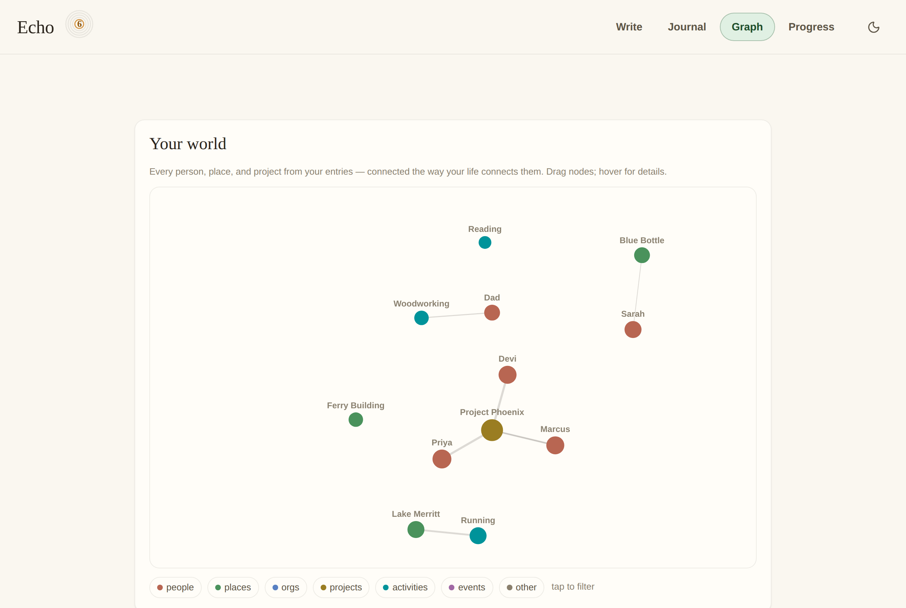
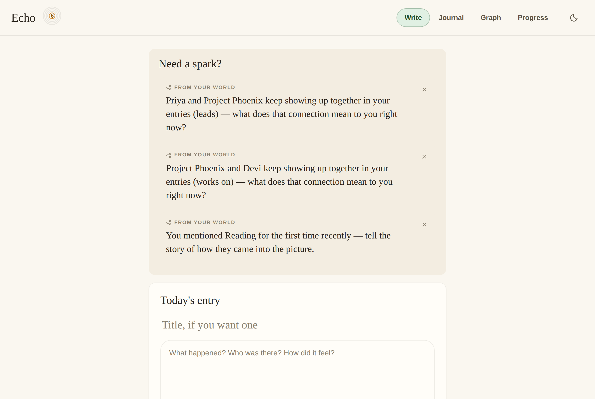
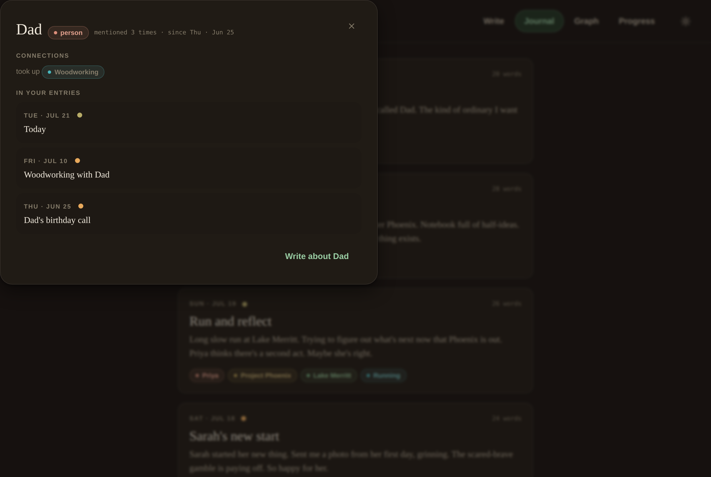

# Echo — journal your world

**A private AI journal that maps the people, places, and projects in your life
into a living knowledge graph — and uses that graph to know what to ask you next.**

Most journaling apps are a text box and a streak counter. Echo reads what you
write. Every entry is parsed for the entities in your life and the relationships
between them, building a graph you can explore — and that graph turns around and
prompts you: *"You haven't written about Sarah in 12 days — how are things
between you two?"* The result is a journal that gets more personal the more you
use it.



---

## The idea in one loop

```
        write an entry
              │
              ▼
   Claude extracts the people, places, projects,
   and the relationships between them
              │
              ▼
   your world (knowledge graph) grows
              │
              ▼
   the graph's edges generate your next prompts
   ("Sarah and Project Phoenix keep coming up together — what does
    that connection mean to you right now?")
              │
              └────────── back to the top, warmer each time
```

Three things make it stick:

- **Processing** — after every entry, a short, warm AI reflection ending in a
  question, to help you sit with what you wrote.
- **Consistency** — streaks, XP, eleven levels, and achievements, all quiet and
  organic rather than corporate.
- **A knowledge graph of your life** — the signature feature, and the engine
  behind the prompts.

---

## Try it in 30 seconds

No dependencies — Python 3.9+ standard library and SQLite only.

```bash
cd journal
python3 seed.py        # optional: fill ~a month of demo entries
python3 app.py         # open http://localhost:8777
```

To turn on the real intelligence (Claude-powered extraction, reflections, and
prompts):

```bash
pip install anthropic
export ANTHROPIC_API_KEY=sk-ant-...
python3 app.py
```

Without a key, Echo runs fully offline on deterministic fallbacks — every
feature works, just with less nuance — so it always demos.

---

## What's inside

| View | What it does |
|---|---|
| **Write** | Distraction-free editor, graph-driven prompts, mood, and the post-save reflection |
| **Journal** | Re-read past entries; every entity is a chip you can click |
| **Graph** | "Your world" — an interactive, force-directed map of everyone and everything you write about |
| **Progress** | Streak ring, level, 14-day chart, and achievements |

**The demo moment:** click any entity — a chip on an entry, or a node in the
graph — and Echo opens that entity's *story*: its type, how often it comes up,
who it's connected to and how, and every entry that mentions it, with a
"write about this" shortcut.

<table>
<tr>
<td></td>
<td></td>
</tr>
<tr>
<td align="center"><em>Write — prompts drawn from your graph</em></td>
<td align="center"><em>Every entity has a story</em></td>
</tr>
</table>

---

## How Claude is used

Echo calls Claude (`claude-opus-4-8`) through the Anthropic Python SDK in
[`journal/ai.py`](journal/ai.py), with a deterministic fallback for every call
so the app never hard-depends on the network:

- **Structured extraction** — each entry is sent with a JSON schema
  (`output_config.format`) so entities and typed relationships come back
  validated, ready to write straight into the graph. Known entities from past
  entries are passed in so names stay consistent across days.
- **Reflections** — a warm, second-person response with one follow-up question.
- **Prompt generation** — a compact summary of the whole knowledge graph is
  handed to Claude to write prompts that only make sense for *your* life.

---

## Architecture

A deliberately small, legible stack — Python standard library HTTP server, no
build step, one SQLite file.

| File | Responsibility |
|---|---|
| `journal/app.py` | HTTP server + JSON API; serves the single-page frontend |
| `journal/ai.py` | Claude integration (extraction, reflection, prompts) + offline fallbacks |
| `journal/graph.py` | Knowledge-graph persistence and the edge-driven prompt rules |
| `journal/gamification.py` | Streaks, XP, levels, achievements, 14-day history |
| `journal/db.py` | SQLite schema |
| `journal/static/index.html` | The whole frontend — four views, canvas graph, design system inline |
| `journal/seed.py` | One-command demo data |

The design system ("warm paper & ink", candlelit dark mode, Newsreader/Karla,
a 7-hue entity palette) was developed in Claude Design and lives inline in the
frontend. Details in [`journal/README.md`](journal/README.md).

---

> **Note on this repository:** the hackathon project is **Echo**, in
> [`journal/`](journal/). The other top-level folders (`directives/`,
> `execution/`, and the `*.json` files) belong to an earlier, unrelated
> lead-generation experiment and are not part of this submission.
